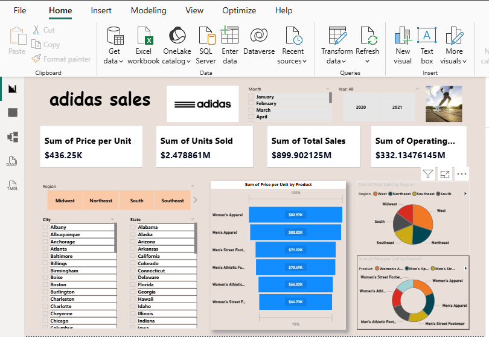

# Adidas-sales
Power BI dashboard for analyzing Adidas sales by product, region, and key business metrics.
إجمالي المبيعات وصل إلى حوالي $899M مع 2.47M وحدة مباعة، مما يعكس أداءً قويًا للشركة في السوق.

الربح التشغيلي بلغ حوالي $332M، ما يدل على هامش ربح جيد.

فئة Women’s Apparel و Men’s Apparel كانت من أكثر الفئات تحقيقًا للإيرادات.

تظهر البيانات أن مناطق مثل West وNortheast تساهم بحصة كبيرة من إجمالي المبيعات.

يوفر الـ Dashboard إمكانية تحليل المبيعات حسب السنة، الشهر، المنطقة، المدينة، والولاية مما يساعد في فهم الأداء الجغرافي والزمني للمبيعات.

Conclusion:
يساعد هذا الـ Dashboard في فهم أداء منتجات Adidas وتحديد الفئات والمناطق الأكثر ربحية لدعم قرارات الأعمال.

